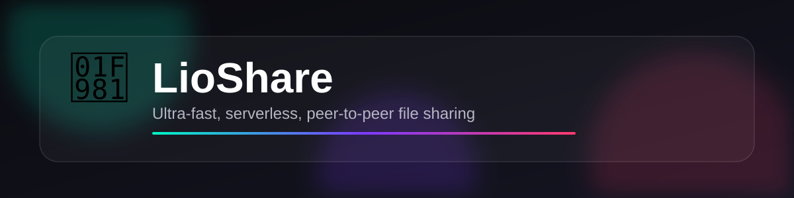

<div align="center">



# 🦁 LioShare

### Ultra-fast, serverless, peer-to-peer file sharing — straight from your browser.

**No sign-up. No file size limits from a server. No uploads to the cloud.**
Files travel **device-to-device** over an encrypted WebRTC connection — nothing ever touches a third-party server.

[](#-live-demo)
[](#-install-as-an-app-pwa)
[](#-how-it-works)
[](#-license)
[](#-privacy--security)
[](./PRIVACY.md)

**P2P file sharing • WebRTC file transfer • no-server file sharing • AirDrop for Android & Windows • Snapdrop alternative • QR code file transfer • self-hosted file sharing PWA**

</div>

---

## 📖 Table of Contents

- [Why LioShare](#-why-lioshare)
- [Features](#-features)
- [Live Demo](#-live-demo)
- [Quick Start](#-quick-start)
- [How It Works](#-how-it-works)
- [Install as an App (PWA)](#-install-as-an-app-pwa)
- [Screenshots](#-screenshots)
- [Tech Stack](#-tech-stack)
- [Project Structure](#-project-structure)
- [Self-Hosting / Deploying Your Own](#-self-hosting--deploying-your-own)
- [Privacy & Security](#-privacy--security)
- [Privacy Policy](#-privacy-policy)
- [Browser Support](#-browser-support)
- [Roadmap](#-roadmap)
- [Contributing](#-contributing)
- [FAQ](#-faq)
- [License](#-license)

---

## ✨ Why LioShare

Sharing a file between your phone and laptop shouldn't require an account, an app store, a cable, or trusting a stranger's server with your data. **LioShare** is a single-page web app that opens a direct, encrypted **WebRTC** data channel between two (or more) devices and streams files directly between them — like AirDrop, but it works everywhere: Android ↔ Windows, iPhone ↔ Linux, browser ↔ browser.

- 🚀 **Direct device-to-device transfer** — no intermediate server ever stores your files
- 🔒 **End-to-end encrypted** by WebRTC's DTLS/SRTP transport, by default
- 🌐 **Cross-platform** — works in any modern browser, on any OS
- 📱 **Installable PWA** — add it to your home screen and use it like a native app
- ⚡ **Zero install for the other side** — just share a link, Room ID, or QR code

## 🧩 Features

| | |
|---|---|
| 📡 **Instant Room ID pairing** | Auto-generated 6-character Room ID — no accounts, no emails |
| ⬛ **QR code connect** | Scan-to-connect with a built-in camera QR scanner |
| 📤 **Multi-file, multi-peer sending** | Queue multiple files and blast them to every connected peer |
| 📥 **Live receive progress** | Real-time per-file progress bars on both ends |
| 🔁 **Synced send/receive status** | Sender and receiver see the *same* confirmed transfer status — the sender's UI is updated by the receiver's live delivery acknowledgements, not just local buffer estimates |
| 💬 **Built-in encrypted chat** | Send text messages over the same P2P data channel |
| 🔗 **One-tap sharing** | WhatsApp, Telegram, SMS, Email, Twitter/X, copy-link, and native share sheet |
| 🧠 **Smart flow control** | Chunked, ACK-style backpressure prevents drops on large files (tested up to 5 GB) |
| 🔋 **Screen Wake Lock** | Keeps the screen awake during active transfers so they don't stall mid-way |
| 🌙 **Background-transfer resilience** | Keepalive pings + reconnect logic keep the connection alive if the tab is backgrounded, and the wake lock re-engages instantly when you return |
| 🧊 **Liquid-glass UI** | A modern, translucent glassmorphism interface with a native-feeling bottom navigation bar |
| 👆 **iOS-style swipe navigation** | Swipe between screens with the same fluid, camera-app-style snap and live indicator tracking — on Android too |
| 💻 **Fully responsive** | Optimised layouts for phones, tablets, and desktop/PC, all from one file |
| 📲 **Installable PWA** | Works offline for the UI shell, installable on Android, iOS, Windows, macOS, Linux |
| 🕵️ **Zero tracking, zero ads, zero server storage** | Your files are never uploaded anywhere |

## 🌍 Live Demo

> Deploy this repo to GitHub Pages (or any static host) and open it on two devices to try it instantly. See [Self-Hosting](#-self-hosting--deploying-your-own) below.

## 🚀 Quick Start

1. Open LioShare on **Device A**.
2. Note the auto-generated **Room ID** (or tap **Share QR**).
3. On **Device B**, either:
   - enter the Room ID and tap **Join**, or
   - scan the QR code, or
   - open the shared link (it auto-joins).
4. Once connected, go to the **Send** tab, drop your files, and tap **Send All to Peers**.
5. Watch the transfer complete on both screens — in sync.

No installs required to receive a file. Only the sender needs to have created the room.

## 🔧 How It Works

```
Device A                         Device B
   │                                 │
   │   1. Generate Room ID           │
   │   2. Open WebRTC PeerConnection │
   │──────────── signalling ────────▶│  (via public PeerJS/STUN broker
   │◀──────────── ICE candidates ────│   — used only to negotiate the
   │                                 │   connection, never sees your files)
   │                                 │
   │═══════ Encrypted P2P DataChannel ═══════│
   │        (files, chat, progress ACKs)      │
```

- Connection negotiation uses public **STUN/TURN** servers only to help two devices find each other through NATs — this is standard for all WebRTC apps (video calls, etc.) and never carries file contents.
- Once connected, files are sliced into chunks and streamed directly over an encrypted **RTCDataChannel**.
- Progress is acknowledged in both directions so sender and receiver always display matching status.
- A **Service Worker** caches the app shell for instant loads and basic offline support.

## 📲 Install as an App (PWA)

LioShare is a full Progressive Web App:

- **Android (Chrome/Edge):** tap the in-app "Install" banner, or use the browser menu → *Install app*.
- **iOS (Safari):** tap Share → *Add to Home Screen*.
- **Desktop (Chrome/Edge):** click the install icon in the address bar.

Once installed, it launches full-screen with no browser chrome, and the Service Worker keeps the shell available even with a flaky connection.

## 🖼️ Screenshots(./assets/connect.png)

## 🛠️ Tech Stack

- **Vanilla JavaScript** — no framework, no build step, no dependencies to install
- **WebRTC** (via [PeerJS](https://peerjs.com/)) for peer connections & data channels
- **Service Worker** for PWA offline shell caching
- **Screen Wake Lock API** to keep the display active during transfers
- Pure **CSS** (glassmorphism / "liquid glass" design system, CSS scroll-snap for navigation)
- Ships as a **single `index.html`** file — easy to audit, easy to self-host

## 📁 Project Structure

```
LioShare-main/
├── index.html      # The entire app: markup, styles, and logic
├── manifest.json   # PWA manifest (icons, theme, display mode)
├── sw.js           # Service worker (offline shell caching + keepalive pings)
├── assets/
│   └── banner.svg  # README banner image
├── LICENSE         # MIT License (© Usama)
├── PRIVACY.md       # Full privacy policy
└── README.md       # You are here
```

## 🌐 Self-Hosting / Deploying Your Own

LioShare is 100% static — deploy it anywhere that serves static files:

**GitHub Pages**
```bash
git clone https://github.com/<your-username>/LioShare.git
cd LioShare
# push to a repo, then enable GitHub Pages on the main branch
```

**Any static host** (Netlify, Vercel, Cloudflare Pages, Firebase Hosting, S3, nginx, etc.)
```bash
# just upload index.html, manifest.json, and sw.js to the web root
```

> ⚠️ The Service Worker registers with `scope: './'` and expects to be served from the site root (or a consistent sub-path) — keep `sw.js` alongside `index.html`.

## 🔐 Privacy & Security

- **No server-side storage** — files are streamed directly between browsers over WebRTC.
- **No accounts, no tracking, no analytics, no ads.**
- WebRTC data channels are encrypted in transit by design (DTLS).
- The only third-party infrastructure involved is public STUN/TURN relays used purely to establish the connection (standard for any WebRTC app) — they never see file contents.
- Because there's no backend, there's no database to be breached and nothing to hand over in the event of a data request.

## 📜 Privacy Policy

For the full, formal privacy policy — covering signalling data, chat messages, local caching, and third-party services — see [**PRIVACY.md**](./PRIVACY.md).

## 🧭 Browser Support

| Browser | Transfer | Wake Lock | QR Scan | Install as PWA |
|---|---|---|---|---|
| Chrome / Edge (Android & Desktop) | ✅ | ✅ | ✅ | ✅ |
| Firefox | ✅ | ⚠️ Partial | ✅ | ⚠️ Partial |
| Safari (iOS/macOS) | ✅ | ⚠️ Partial | ✅ | ✅ (Add to Home Screen) |
| Samsung Internet | ✅ | ✅ | ✅ | ✅ |

> The Screen Wake Lock API is only granted while the app is the visible, foreground tab — this is a browser/OS-level restriction on every platform, not something any web app can override. LioShare re-acquires the lock the instant you return to the tab, and uses keepalive techniques to keep the transfer itself progressing while backgrounded.

## 🗺️ Roadmap

- [ ] Resume interrupted transfers after a dropped connection
- [ ] Multi-file zip bundling before send
- [ ] Optional end-to-end passphrase for room access
- [ ] Transfer history log
- [ ] Native share-target integration (share *into* LioShare from other apps)

Have an idea? [Open an issue](../../issues) or submit a PR.

## 🤝 Contributing

Contributions, bug reports, and feature requests are welcome!

1. Fork the repo
2. Create a feature branch (`git checkout -b feature/amazing-thing`)
3. Commit your changes
4. Open a Pull Request

Since this is a single-file, dependency-free app, most changes only touch `index.html` — please keep it framework-free and dependency-free where possible.

## ❓ FAQ

**Does LioShare store my files anywhere?**
No. Files are streamed directly between the sender and receiver's browsers. Nothing is uploaded to a server.

**What's the max file size?**
Up to 5 GB per file in the current build (configurable in `index.html`), limited mainly by device memory and connection stability, not a server quota.

**Do both people need to install anything?**
No. LioShare runs entirely in the browser. Installing it as a PWA is optional and just for convenience.

**Why do I need an internet connection if it's peer-to-peer?**
WebRTC still needs a lightweight signalling step and STUN/TURN servers to help two devices behind NATs find each other — this is how *all* WebRTC apps work, including video calls. Once connected, the file data itself flows directly device-to-device.

**Can I use this on a local network with no internet at all?**
If both devices can reach the same signalling server, yes — for a fully offline LAN setup you'd need to self-host the signalling/STUN layer as well.

## 📄 License

Licensed under the [MIT License](LICENSE) — free to use, modify, and self-host.

**Copyright © 2026 Usama.** All rights reserved under the terms of the MIT License above.

---

<div align="center">

**If LioShare saved you a cable, an upload, or an account sign-up — consider giving it a ⭐!**

Made with 🦁 by **Usama**

</div>
